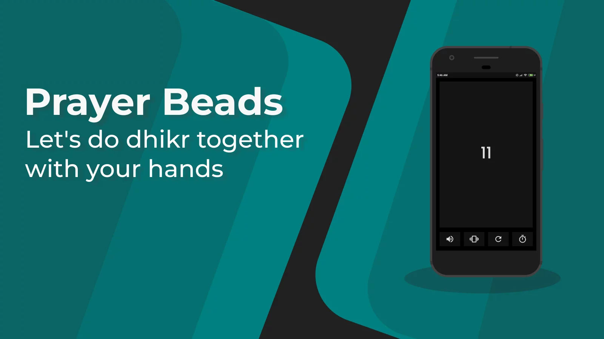

## About Project

Android-based digital tasbih, which was created to help count you in dhikr. You can feel the tapping sensation by vibration or sound.

### Built With

## License

Distributed under the MIT License. See [LICENSE](LICENSE) for more information.
